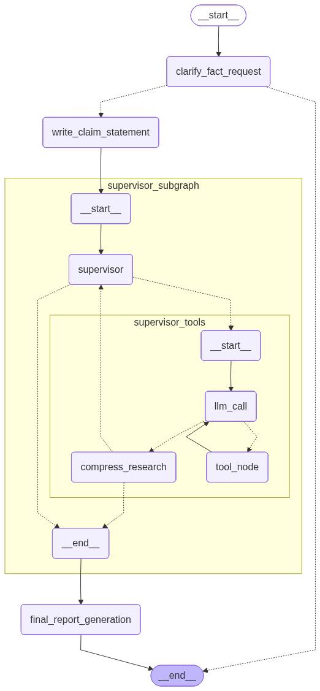

# FactShield AI – AI-Powered Fact-Checking System

FactShield AI is a multi-agent deep research fact-checking system built with LangChain and LangGraph. It clarifies user claims, orchestrates parallel research with tools, and produces a polished, citation-rich Markdown report. Use it via a CLI workflow or a Streamlit web app.

## Workflow



## Key Features

- Claim clarification and scoping to ensure verifiability
- Structured claim brief generation
- Multi-agent supervisor that can delegate parallel research tasks
- Web search via Tavily with evidence summarization and stance tagging
- Deliberate “think” steps between searches for higher quality
- Research compression and final report generation with inline citations
- Outputs saved to `final_reports/` and downloadable in the Streamlit UI

## Workflow


Note: Ensure the image file exists at `resources/workflow.png` so it renders correctly.

## Architecture Overview

FactShield uses LangGraph state machines across three layers:

1) Scope layer (`factchecker_agent_scope.py`)
	- Nodes: `clarify_fact_request` → `write_claim_statement`
	- Routes to clarification or produces a structured claim brief.

2) Supervisor layer (`factchecker_multi_agent_supervisor.py` + `state_multi_agent_supervisor.py`)
	- Supervisor decides research strategy and tool usage.
	- Tools: `think_tool` (reflection), `ConductResearch` (delegates to sub-agents), `ResearchComplete`.
	- Can launch multiple fact-checker sub-agents in parallel when beneficial.

3) Fact-checker sub-agent (`factchecker_agent.py` + `state_research.py`)
	- Loop: `llm_call` → (tools) → `compress_research`
	- Tools: `tavily_search` (web search + summarize), `think_tool`.

4) Final report (`main.py`)
	- Aggregates notes from the supervisor and generates a Markdown report saved to `final_reports/`.

Model configuration lives in `utils.py` via `create_llm()` and `create_compress_llm()`. Prompts are in `prompts.py`. Terminal UX helpers are in `niceterminalui.py`.

## Requirements

- Python 3.13+
- API keys (depending on your chosen LLM provider and search):
  - Tavily: `TAVILY_API_KEY`
  - Google GenAI (default): `GOOGLE_API_KEY`
  - or OpenAI: `OPENAI_API_KEY`
  - or Groq: `GROQ_API_KEY`

Dependencies are declared in `pyproject.toml` (LangChain, LangGraph, Streamlit, Rich, Tavily, etc.).

## Setup

1) Create and activate a virtual environment

```bash
python -m venv .venv
source .venv/bin/activate
```

2) Install dependencies

```bash
pip install -e .
```

If you use uv (optional):

```bash
uv venv
source .venv/bin/activate
uv pip install -e .
```

3) Configure environment variables (create a `.env` in the repo root)

```env
# LLM provider and model (defaults shown match utils.py)
LLM_PROVIDER=google_genai
LLM_MODEL=gemini-2.5-flash
LLM_TEMPERATURE=0.1

# Compression model for long summaries
COMPRESS_LLM_PROVIDER=google_genai
COMPRESS_LLM_MODEL=gemini-2.5-flash
COMPRESS_LLM_TEMPERATURE=0.1
COMPRESS_LLM_MAX_TOKENS=32000

# Search
TAVILY_API_KEY=your_tavily_api_key

# Provider-specific API keys (set the one that matches LLM_PROVIDER)
GOOGLE_API_KEY=your_google_api_key
OPENAI_API_KEY=your_openai_api_key
GROQ_API_KEY=your_groq_api_key
```

## Run

CLI (interactive):

```bash
python main.py
```

Streamlit app:

```bash
python run_streamlit.py
# or
streamlit run streamlit_app.py
```

The CLI saves the final report in `final_reports/` as a Markdown file with a sanitized title. The Streamlit app also lets you download the report directly from the browser.
